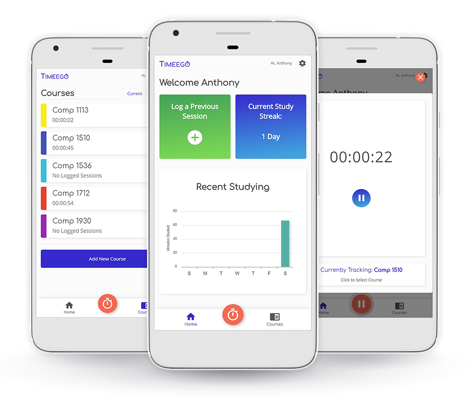

  

Timeego is a web application designed to help students with track their time spent studying. It allows users to add courses, log their time studying, and view their total study time in each course.

  

## Project Information

Timeego was built as a group project for [COMP 1930](https://www.bcit.ca/study/outlines/20193045320), a first-term course in the [Computer Systems Technology](https://www.bcit.ca/study/programs/5500dipma#courses) program at [BCIT](https://www.bcit.ca).

Our team consisted of three BCIT students.

## Installation

Simply clone the repository from GitHub, and open public/index.html to begin.

## Hosting

Timeego is hosted publicly at https://timeego-d54c4.firebaseapp.com.

## JavaScript File Organization

This section explains the JavaScript organization. We used a form of the MVC design pattern to divide our logic.

### Controllers

Each HTML file only imports controllers. Each page has it's own file. There is also a global.js controller that contains logic used across all pages (header, timer pop-up). There is also a helpers file that holds functions that are shared across multiple controller files.

Controllers are the logic of the app. They are where we set up event-listeners (page specific or global), get data from forms, and make calls to our database files (models).

### Models

#### Firestore - Database

There is one main database file (firebase.js).

In the firebase file, there is an object for each page. There is also an object for global features (timer, header).

The methods in the firebase objects are called by the controller files when they are needed. The firebase methods then talk to the database to perform specific functions (read, write, update, delete).

When HTML elements need to be rendered, the firebase methods do this by calling the appropriate view (from the views.js file) and passing in the data from the database as a parameter.

#### Classes

There are also two model files to track state across the app. Because we didn't have a true backend, we decided to use local storage to track the current time on the timer pop-up. Using this method reduced the number of database calls that would have had to be made otherwise.

stopwatch.js holds the majority of the state needed for the timer pop-up. On every page load, it is made from the information held in local storage. It also save's its state to local storage every time anything in the stopwatch saves. This keeps the app up to date between different page loads.

session.js is used to create a new session. This only tracks the time of that specific session. Separating it from the stopwatch class helps to make stopwatch.js less cluttered.

### Views

Each page has it's own view file. There is also a helpers file to hold functions that are shared across multiple view files.

There is a view object for each page. There is also a view for global elements (timer, header).

Views are called by the methods in the firebase file, or by controller files. They take data from the database, and render the dynamic HTML elements.

### Config

Files in the config directory hold settings for Firebase, Firestore and ApexChart.js.

## 3rd Party Tools Used

This is a list of 3rd party resources used in this project:

* [Google Firebase & Firestore](https://firebase.google.com/)
* [Bootstrap](https://getbootstrap.com/)
* [jQuery](https://jquery.com/)
* [Material Icons](https://material.io/resources/icons/?style=baseline)
* [ApexChart.js](https://apexcharts.com/)
* [Color Picker by G Naga Subrahmanyam](https://codepen.io/GNSubrahmanyam/pen/OpmMjN)

## To Do List

A list of things left to accomplish.

### Stretch/Future Goals
* [ ] Stretch - Timer Pop-up - Fix CSS for landscape mode phones.
* [ ] Stretch - Add Session Page - add functionality.
* [ ] Stretch - Add Goal tracking to app.

